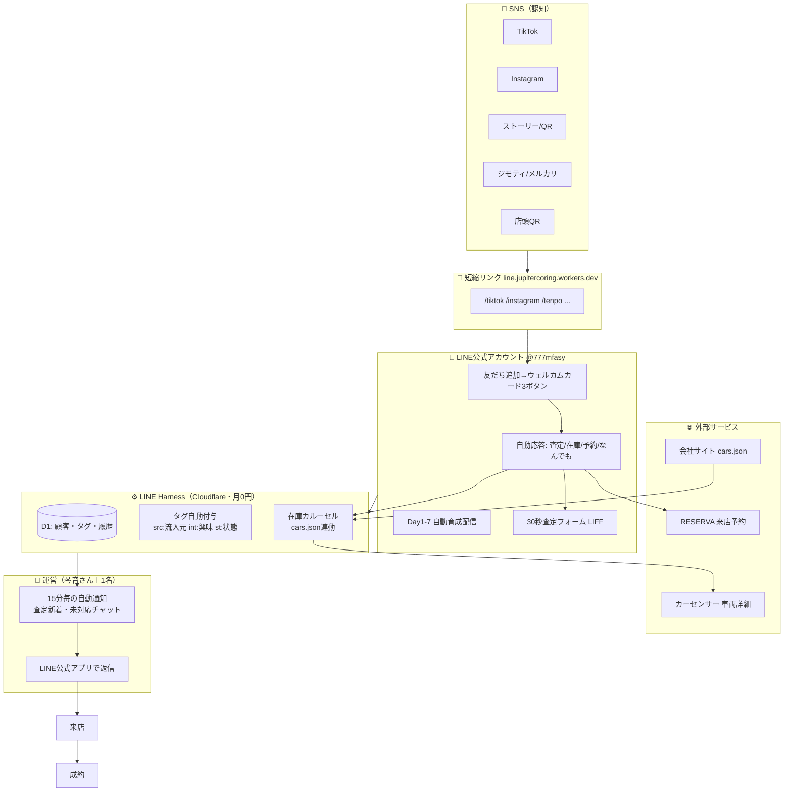
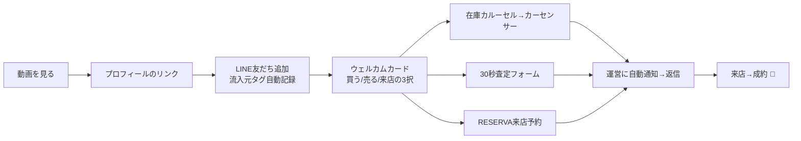

# 📍 JupiterCoring 集客システム — 全体マップ（まずここを読む）

最終更新: 2026-07-19。**どこに何があるか迷ったらこのファイル。**

## 全体構成図



## お客様の旅（ファネル）



## 📂 ファイルの地図

```
carshop/
├── docs/ ………………………………… 📚 ドキュメント置き場
│   ├── README.md ……………………… ★このファイル（全体マップ）
│   ├── LINE運用マニュアル.md ………… 毎日・毎週やること
│   ├── 動画制作マニュアル.md ………… 動画の作り方・品質チェックリスト・SNSプロフィール設定
│   ├── LINE集客システム全体像.md …… 第三者への説明用1枚
│   ├── 引き継ぎ状況まとめ.md ………… ChatGPT等の他AIに貼る用（機密なし）
│   └── line-harness-crm-plan.md …… 技術詳細の全記録（開発者向け）
│
├── tools/
│   ├── line-harness-seed/ …………… ⚙️ LINE CRMの初期投入＆運用コマンド
│   │   ├── README.md ………………… 使い方一覧
│   │   ├── seed.mjs …………………… 初期設定の一括投入（再構築用）
│   │   ├── update-inventory.mjs …… ★在庫が変わったら実行（カルーセル更新）
│   │   ├── broadcast.mjs …………… セグメント配信
│   │   ├── kpi.mjs …………………… 週次KPI集計
│   │   ├── notify-owner.mjs ……… 15分毎の運営通知（タスクスケジューラが自動実行）
│   │   └── richmenu/ ……………… リッチメニュー・ウェルカム画像の素材
│   │
│   ├── link-shortener/ ……………… 🔗 短縮URL（line.jupitercoring.workers.dev）
│   │
│   └── social-assets/ ……………… 🎨 SNS素材
│       ├── Instagramストーリー作成プロンプト.md … ChatGPTに貼る手順書
│       └── stories/ ………………… ストーリー画像（QR入り完成品PNG）
│
└── .env …………………………………… 🔐 全認証情報（git管理外・外部AIに貼らない）
```

## 🔗 各媒体に貼るリンク（短縮版・こちらを使う）

| 媒体 | 貼るURL |
|---|---|
| TikTok | `line.jupitercoring.workers.dev/tiktok` |
| Instagramプロフィール | `line.jupitercoring.workers.dev/instagram` |
| Instagramストーリー | `line.jupitercoring.workers.dev/instagram_story`（QR画像は作成済み） |
| ジモティ | `line.jupitercoring.workers.dev/jimoty` |
| メルカリ | `line.jupitercoring.workers.dev/mercari` |
| 店頭QR | `line.jupitercoring.workers.dev/tenpo` |
| 紹介 | `line.jupitercoring.workers.dev/intro` |

すべて `https://` を頭に付ければそのまま開けます。裏で計測付きの正式URLへ転送されるので、**流入元の自動計測はそのまま機能します**。

## 🤖 自動で動いているもの（ルーティン一覧）

| 名前 | 頻度 | 何をする | 動く場所 |
|---|---|---|---|
| ステップ配信cron | 5分毎 | Day1-7育成メッセージの配信・予約配信 | Cloudflare（常時） |
| carshop-line-notify | 15分毎 | 査定新着・未対応チャットをLINEに通知 | **このPC**（起動中のみ） |
| X自動投稿bot | 毎日 | 在庫紹介をXに自動投稿 | GAS（Google） |
| カーセンサー在庫同期 | 定期 | 公開ページ→cars.json更新 | kotokoto-company-site |

## 💬 Claudeへの魔法の言葉（これだけ覚えればOK）

| 言うこと | 起きること |
|---|---|
| 「**今日の分**」 | その日の動画台本・テロップ・投稿文・投稿時刻をフルパック納品 |
| 「**今週のLINE見せて**」 | KPI集計＋今週やるべきことの提案 |
| 「**在庫更新して**」 | 在庫カルーセルをcars.jsonから最新化 |
| 「**◯◯売れた**」 | 掲載削除リマインド＋売約報告投稿＋口コミ依頼の段取り |
| 「**△△さんが友だち追加した**」 | 通知の宛先にその人を追加 |

## 💼 営業代行の応募を自動化する（2026-08-22 追加）

営業代行案件の **探す → 選ぶ → 応募文を書く → フォームに入れる** を自動化するツール一式。
送信ボタンだけ自分で押す設計（誤送信を防ぐため、そこだけは自動化しない）。

| やりたいこと | 場所 |
|---|---|
| **案件を選ぶ基準（正本・実践活動FAQ）** | [`tools/sales-apply/案件選定ルール.md`](../tools/sales-apply/案件選定ルール.md) |
| 使い方（Chrome拡張の入れ方から） | [`tools/sales-apply/README.md`](../tools/sales-apply/README.md) |
| 自分の情報（応募文の材料） | `tools/sales-apply/profile/profile.json` |
| まだ埋まっていない項目を確認 | `npm run apply:doctor` |
| 文体のルール（AI感を消す決まりごと） | [`tools/sales-apply/profile/voice.md`](../tools/sales-apply/profile/voice.md) |
| 面接のカンペを作る | `node tools/sales-apply/cli.mjs interview` |
| Claudeに答えてほしい質問リスト | [`tools/sales-apply/質問リスト.md`](../tools/sales-apply/質問リスト.md) |

> 🚫 **クラウドワークスは使用禁止**（実践活動ルール）。媒体は複業クラウド・ランサーズ・Indeed を使う。
